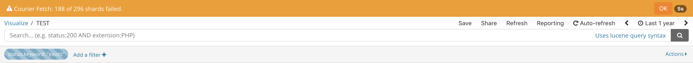
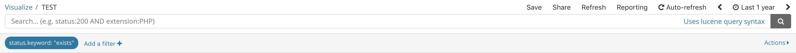

#installing beat
PowerShell.exe -ExecutionPolicy UnRestricted -File .\install-service-metricbeat.ps1

PowerShell.exe -ExecutionPolicy UnRestricted -File .\install-service-winlogbeat.ps1


#problem the timeout when logstash is added as services


you can use nssm
however to make sure it integrates well with all the setup, it is strongly recommended to run it with the appropriate user rather than local user


# troubleshooting


## Adjust `thread_pool` 

thread_pool.index.queue_size: 5000
thread_pool.bulk.queue_size: 5000
thread_pool.search.queue_size: 10000

## field does not exist

here is an example that reproduce the problem when an aggregation is performed on a filed that may not exist consistently across the data set.

### Without filter on field exist


### With filter on field exist




## set fielddata

example filebeat-6.2.1 vs 6.2.3


```
#filebeat-6.2.1
GET {{hostname}}:{{ElkPort}}/filebeat-6.2.1*/_mapping/
 "source": {
                        "type": "keyword",
                        "ignore_above": 1024
                        }
GET {{hostname}}:{{ElkPort}}/filebeat-6.2.3*/_mapping/
"source": {
                        "type": "text",
                        "fields": {
                            "keyword": {
                                "type": "keyword",
                                "ignore_above": 256
                            }
                        },
                        "fielddata": true
                    }
```
Problem
====
filebeat 6.2.1 has source of type keyword while 6.2.3 is text, the difference is that in 6.2.1 there is no field 'source.keyword' while fieldata set to true allow to index on source, in 6.2.3 fielddata is et to false then it is not index on source but only on source.keyword!

when building a dashboard on source, elk index well for 6.2.1 but cannot for 6.2.3. however we cannot chose source.keyword as common field to index as it does not exist in 6.2.1!! solution is to set fielddata to true for source on filebeat 6.2.3

Solution 
===
```
# force elk to index on source
PUT {{hostname}}:{{ElkPort}}/filebeat-6.2.3*/_mapping/doc
{
  "properties": {
     "source": {        "type" : "text",
                        "fielddata" : true
                        }
  }
}
```

Same happened with windlogbeat \with version 5.5.1 and 6.x

Solution

```


```


### logfile from elasticsearch

```
org.elasticsearch.transport.RemoteTransportException: \[node*****\]\[IP********\][indices:data/read/search[phase/query]]
Caused by: org.elasticsearch.common.util.concurrent.EsRejectedExecutionException: rejected execution of org.elasticsearch.transport.TransportService$7@6f15b0af on EsThreadPoolExecutor[search, queue capacity = 1000, org.elasticsearch.common.util.concurrent.EsThreadPoolExecutor@15dc55b7[Running, pool size = 7, active threads = 7, queued tasks = 1000, completed tasks = 7760]]
```

# elasticsearch.yml tuning

```
# this parameter really fix the problem
thread_pool.search.queue_size: 5000

# it does not harm to consider looking at the following as well

thread_pool.index.queue_size: 5000
thread_pool.bulk.queue_size: 5000

```


lucene to DSL

{
  "query": {
    "query_string": {
      "analyze_wildcard": true,
      "default_field": "_all",
      "query": "CRM_E_CRMfrmLogin_Created AND Start"
    }
  }
}


# take record having field Component not empty and having Start word somewhere in the message
{
  "query": {
    "query_string": {
      "analyze_wildcard": true,
      "default_field": "_all",
      "query": "Component:[* TO *] AND Start"
    }
  }
}


lucene syntaz to find out the process
Component:[* TO *] AND Message:"?Start^SessionId*"


grok for openspan


filter {


if [type] =~ /openspan.runtimelog/
{
csv{
separator => "|"
    columns => ["MsgType","TimeStamp","Thread","State","Category","DesignComponent","Component","Message"]
}
grok {
    match => ["Component","(?<ComponentName>(.*?))[-]+(?<ComponentIndex>[0-9]+[ ]*$)"]
  }

}


grok to read create date that is defined once atthe beginning of the logfile and happened it in all timestamp that only content time and no date


 if [runinglog.createdate]
       {
ruby
{
			init => "@@credate = '10/16/2017'"
			code => "@@credate = event.get('[runinglog.createdate]')"
}
  
}
ruby
{
code => "event.set('TimeStamp', event.get('TimeStamp') + @@credate)"
}


```
Joda-Time.
Symbol  Meaning                      Presentation  Examples
 ------  -------                      ------------  -------   
 a       halfday of day               text          PM
 K       hour of halfday (0~11)       number        0
 h       clockhour of halfday (1~12)  number        12

 H       hour of day (0~23)           number        0
 k       clockhour of day (1~24)      number        24
 m       minute of hour               number        30
 s       second of minute             number        55
 S       fraction of second           number        978
 
 ```


# Security

## generates key using certgen


## Datediff issue : use datediff_big


If the return value is out of range for int (-2,147,483,648 to +2,147,483,647), an error is returned. For millisecond, the maximum difference between startdate and enddate is 24 days, 20 hours, 31 minutes and 23.647 seconds. For second, the maximum difference is 68 years.


## setting number of file descriptor


ES_JAVA_OPTS="-XX:-MaxFDLimit" ./bin/elasticsearch

"open_file_descriptors": 13876,
"max_file_descriptors": 924288,


### configured /etc/sysctl.conf

MBP15:libexec rumi$ more /etc/sysctl.conf 
net.inet.ip.forwarding=1
net.inet6.ip6.forwarding=1
kern.maxprocperuid=1000
kern.maxproc=2000
kern.maxfilesperproc=20000
kern.maxfiles=50000

### Configure limit.maxfiles.plist on osx

```
MBP15:libexec rumi$ more  /Library/LaunchDaemons/limit.maxfiles.plist
<?xml version="1.0" encoding="UTF-8"?>  
<!DOCTYPE plist PUBLIC "-//Apple//DTD PLIST 1.0//EN"  
        "http://www.apple.com/DTDs/PropertyList-1.0.dtd">
<plist version="1.0">  
  <dict>
    <key>Label</key>
    <string>limit.maxfiles</string>
    <key>ProgramArguments</key>
    <array>
      <string>launchctl</string>
      <string>limit</string>
      <string>maxfiles</string>
      <string>924288</string>
      <string>924288</string>
    </array>
    <key>RunAtLoad</key>
    <true/>
    <key>ServiceIPC</key>
    <false/>
  </dict>
</plist> 
```


