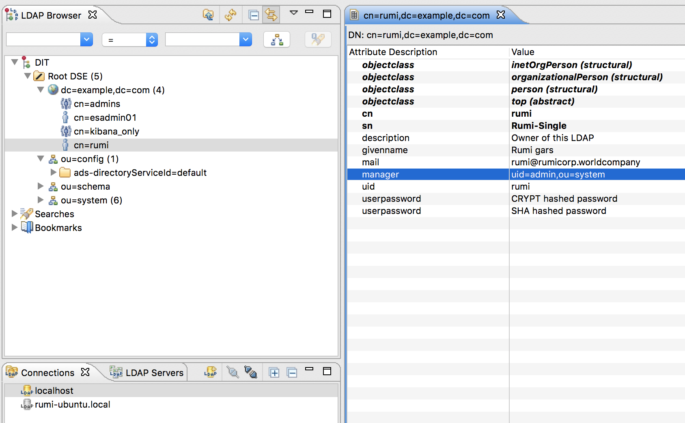
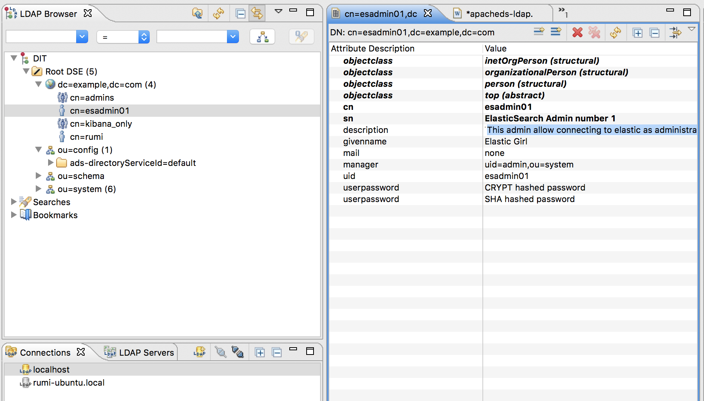

# Apache DS : LDAP sandbox

Background
==========
If you work for a big organization (very much like I have done throughout my career either as an external consltant or an employee), it may be challenging to get access to the technology to experiment and get yourself ready for production deployment. The question seems to be like the the chicken-eggs syndrome : how can you prepare yourself to bring all the pieces to a solution if you cannot experiment. A the time I write these lines, I have been working for quite sometime on a cool technology call elastic. In order to help my colleagues, I have built many comprehensive example on how to integrate the technology in the context of the bank. No way you can go around security in big organisaiton, this is why I decided to test the solution in the context of LDAP integration. This is not like I needed to learn LDAP but I wanted to make sure that before even ask anyone to provide access to ldap to integrate my piece of technology in the real world by myself; then I like to use experiment as a trail blaizer. 

**How can I test LDAP integration, the answer : using ApacheDS.**

> Note we should never blame big organization to put rules and regulations in order to govern the way technology is brought in, it is just a matter of striking the right ballance between allowing people to innovate and experiment and putting new tech in the pipeline. Devops can really help to alleviate any fears about the pace of change, today we can realease software faster than ever before and more secure than ever before : we just need to reconcile the perception that releasing often through devops is more secured than releasing once per year like in the 60s-80s. 


## Introduction to apacheDS

What I like about apache is that it is not only open source but it works pretty easily on the operating system that I like most : OSX and ubuntu! Even thought this is not all the time a finalized and polished product, it is very often being packaged by commercial firms that do a fabulous job in the packaging while the core stays very much the same.

ApacheDS comes as a very package solution :
- Apache DS :LDAP and Kerberos server written in Java
- Apache DS Studio : The Eclipse-based LDAP browser and directory client
- Apache DS eclipse plugin : which will augment your already custom eclipse IDE


### ldap command-line samples


here is ldap tree:




```
#
$ ldapsearch -h localhost -p 10389 -L -D "cn=rumi,dc=example,dc=com" -w changeme -b "dc=example,dc=com" -s sub "(cn=rumi)" +
version: 1

#
# LDAPv3
# base <dc=example,dc=com> with scope subtree
# filter: (cn=rumi)
# requesting: + 
#

# rumi, example.com
dn: cn=rumi,dc=example,dc=com
entryCSN: 20180227150928.786000Z#000000#001#000000
nbSubordinates: 0
nbChildren: 0
creatorsName: 0.9.2342.19200300.100.1.1=admin,2.5.4.11=system
modifyTimestamp: 20180227150928.786Z
entryDN: cn=rumi,dc=example,dc=com
modifiersName: 0.9.2342.19200300.100.1.1=admin,2.5.4.11=system
entryUUID: f4ef9f04-06b1-4f59-99e4-3dbfb5663d87
pwdHistory: 20180225211716.969Z#1.3.6.1.4.1.1466.115.121.1.40#44#e1NIQX1uVTRlS
 TcxYmNuQkdxZU8wdDl0WHZZMXU1b1E9
createTimestamp: 20180225211716.970Z
subschemaSubentry: cn=schema
entryParentId: a2d9df77-1b90-4187-948c-1984fe59ca41

# search result

# numResponses: 2
# numEntries: 1
```


Ldap tree :




```
$ ldapsearch -h localhost -p 10389  -D "cn=rumi,dc=example,dc=com" -w changeme -b "dc=example,dc=com" -s sub "(cn=esadmin01)" 
# extended LDIF
#
# LDAPv3
# base <dc=example,dc=com> with scope subtree
# filter: (cn=esadmin01)
# requesting: ALL
#

# esadmin01, example.com
dn: cn=esadmin01,dc=example,dc=com
mail: none
manager: uid=admin,ou=system
givenname: Elastic Girl
sn: ElasticSearch Admin number 1
cn: esadmin01
objectclass: top
objectclass: inetOrgPerson
objectclass: person
objectclass: organizationalPerson
description: This admin allow connecting to elastic as administrator without t
 he need to create any user in elastic. Be caereful that role mapping in elast
 ic needs to be configured to allow ldap to work.
userpassword:: e1NIQX1uVTRlSTcxYmNuQkdxZU8wdDl0WHZZMXU1b1E9
userpassword:: e0NSWVBUfTZVQVJxeUZheUZyeC4=
uid: esadmin01

# search result
search: 2
result: 0 Success

# numResponses: 2
# numEntries: 1
```

```
MBP15:libexec rumi$ ldapsearch -h localhost -p 10389 -L -D "cn=rumi,dc=example,dc=com" -w changeme -b "dc=example,dc=com" -s sub "(cn=esadmin01)" +
version: 1

#
# LDAPv3
# base <dc=example,dc=com> with scope subtree
# filter: (cn=esadmin01)
# requesting: + 
#

# esadmin01, example.com
dn: cn=esadmin01,dc=example,dc=com
entryCSN: 20180227151420.737000Z#000000#001#000000
nbSubordinates: 0
nbChildren: 0
creatorsName: 0.9.2342.19200300.100.1.1=admin,2.5.4.11=system
modifyTimestamp: 20180227151420.737Z
entryDN: cn=esadmin01,dc=example,dc=com
modifiersName: 0.9.2342.19200300.100.1.1=admin,2.5.4.11=system
entryUUID: c602f56c-83ec-406b-aecc-af2c8fd1caba
pwdHistory: 20180225211716.950Z#1.3.6.1.4.1.1466.115.121.1.40#44#e1NIQX1uVTRlS
 TcxYmNuQkdxZU8wdDl0WHZZMXU1b1E9
createTimestamp: 20180225211716.951Z
subschemaSubentry: cn=schema
entryParentId: a2d9df77-1b90-4187-948c-1984fe59ca41

# search result

# numResponses: 2
# numEntries: 1
```